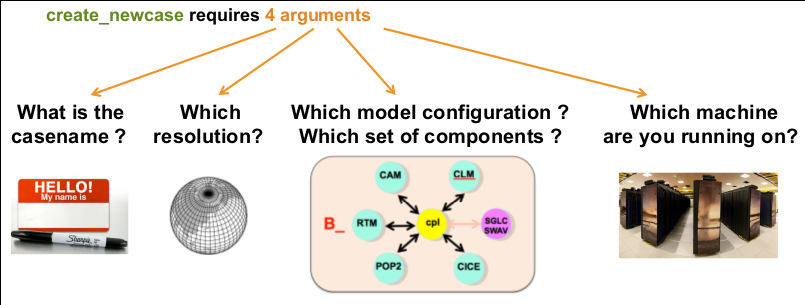
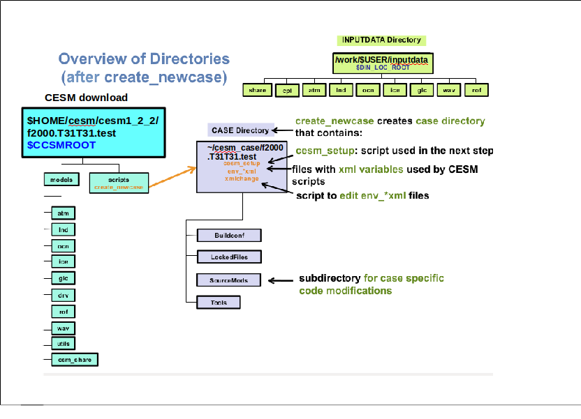
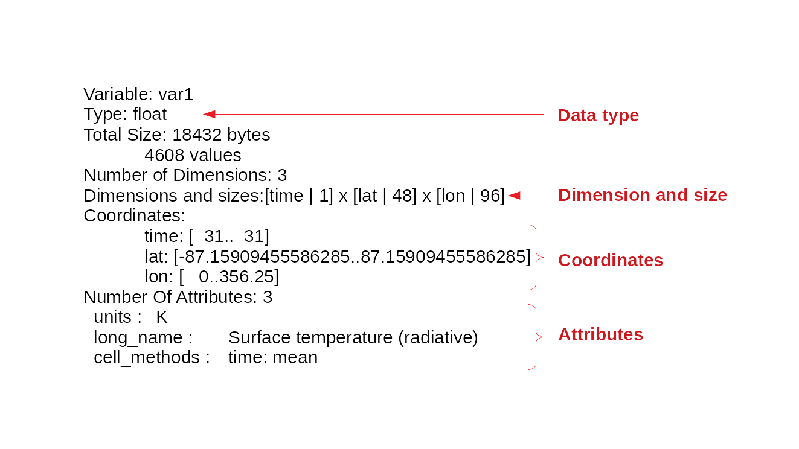
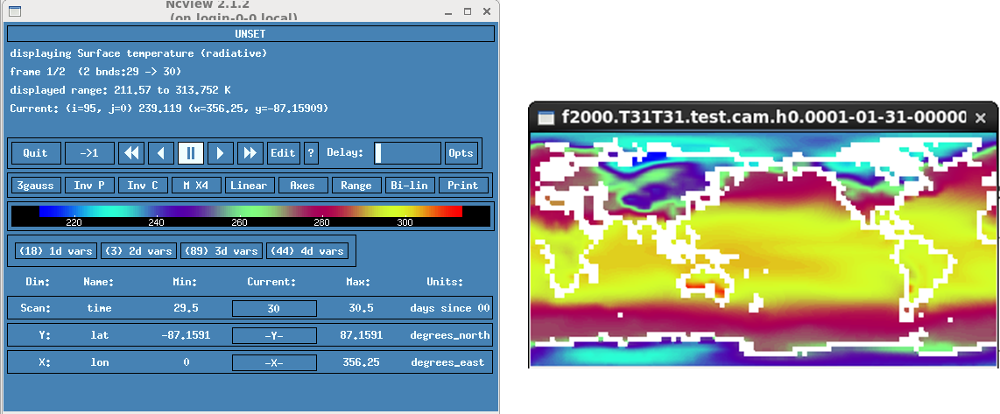

# First practical: get familiar with cesm

We do all the practicals on Abel.  

*   [Notur Initialization](#notur-initialization)
*   [Create a New case](#create-a-new-case)
*   [Running a case](#running-a-case)
*   [Monitor your test run](#monitor-your-test-run)
*   [First look at your 1 month test run](#first-look-at-your-1-month-test-run)
	*   [What is a netCDF file](#What-is-a-netcdf-file)
	*   [Inspect a netCDF file](#inspect-a-netcdf-file)
	*   [Quick visualization of a netCDF file](#quick-visualization-of-a-netcdf-file)

### Notur Initialization

Make sure you have set-up your SSH keys properly and you can transfer files with scp without entering your password. If not go [here](http://www.mn.uio.no/geo/english/services/it/help/using-linux/ssh-tips-and-tricks.html).  

To run CAM-5.3 on abel, we will use:

*   Subversion client (version 1.6.11) to get CESM source code
*   Fortran and C compilers (intel 2015.0 compilers)
*   NetCDF library (netcdf4.3.3.1)
*   MPI (intel openmpi 1.8.3)

To be able to compile and run CESM on abel, no changes to the source code are necessary; we just have to adapt a few scripts for setting the compilers and libraries used by CESM.  

To simplify and allow you to run CESM as quickly as possible, we have prepared a set-up script geo4962_notur.bash.  

On Abel:  

~~~
cd $HOME

module load git

git clone https://github.com/NordicESMhub/GEO4962.git

cd $HOME/GEO4962

git checkout master

cd setup

chmod u+rwx geo4962_notur.bash

./geo4962_notur.bash

~~~
{: .language-bash}

The script above copies the source code in $HOME/cesm/cesm_1_2_2 and creates symbolic links for the input data necessary to run our model configuration in /work/users/$USER/inputdata. Input data can be large this is why we create symbolic links instead of making several copies (one per user). The main copy is located in $CESM_DATA (CESM_DATA is an environment variable that is defined when executing geo4962_notur.bash).  

### Create a New case

Now that you have the CESM source code in $HOME/cesm/cesm_1_2_2, you can have a first look at the code.  
  

We will build and run CAM in its *standalone* configuration i.e. without having all the other components **active**.  

The basic workflow to run the CESM code is the following:

*   Create a New Case
*   Invoke cesm_setup
*   Build the Executable
*   Run the Model and Output Data Flow

To create a new case, we will be using create_newcase script. It is located in $HOME/cesm/cesm1_2_2/scripts.  
There are many options and we won't discuss all of them. The online help provides information about how get the full usage of create_newcase.

On Abel:  

~~~
./create_newcase --help
~~~
{: .language-bash}

The 4 main arguments of create_newcase are explained on the figure below:   

On Abel:

~~~
cd $HOME/cesm/cesm1_2_2/scripts

#
# Simulation 1: short simulation
#

module load cesm/1.2.2

./create_newcase -case ~/cesm_case/f2000.T31T31.test -res T31_T31 -compset F_2000_CAM5 -mach abel
~~~
{: .language-bash}

*   **case**: specifies the name and location of the case being created. It creates a new case in $HOME/cesm_case and its name is f2000.T32T31.test
*   **res**: specifies the model resolution (resolution of the grid). Each model resolution can be specified by its alias, short name or long name:
    *   alias: T31_T31 (atm/lnd_ocn/ice)
    *   short name: T31_T31
    *   long name: a%T31_l%T31_oi%T31_r%r05_m%gx3v7_g%null_w%null (atm,lnd,ocn/ice,river,lnd mask, lnd-ice,wave)  
    The full list of supported grid is given [here](http://www.cesm.ucar.edu/models/cesm1.2/cesm/doc/modelnl/grid.html).
*   **compset**: specifies the component set, i.e., component models, forcing scenarios and physics options for those models.  
    As for the resolution, the component set can be specified by its alias, short name or long name:
    *   alias: FC5
    *   short name: F_2000_CAM5
    *   long name: 2000_CAM5_CLM40%SP_CICE%PRES_DOCN%DOM_RTM_SGLC_SWAV  
    The notation for the compset longname is:  

    <pre>   TIME_ATM[%phys]_LND[%phys]_ICE[%phys]_OCN[%phys]_ROF[%phys]_GLC[%phys]_WAV[%phys][_BGC%phys]
    </pre>

    The compset longname has the specified order: **atm, lnd, ice, ocn, river, glc wave cesm-options**.  
    
    Where:

    <pre>   TIME = Time period (e.g. 2000, 20TR, RCP8...)
       ATM  = [CAM4, CAM5, DATM, SATM, XATM]
       LND  = [CLM40, CLM45, DLND, SLND, XLND]
       ICE  = [CICE, DICE, SICE, SICE]
       OCN  = [POP2, DOCN, SOCN, XOCN,AQUAP,MPAS]
       ROF  = [RTM, DROF, SROF, XROF]
       GLC  = [CISM1, SGLC, XGLC]
       WAV  = [WW3, DWAV, SWAV, XWAV]
       BGC  = optional BGC scenario
    </pre>

    The OPTIONAL %phys attributes specify submodes of the given system.
    
    The list of available component set is given [here](http://www.cesm.ucar.edu/models/cesm1.2/cesm/doc/modelnl/compsets.html). 
    
    In our case we have:
    *   TIME = 2000: we are running our model for present days
    *   ATM = CAM5: we will be using CAM5 for the atmospheric component
    *   LND = CLM40%SP: Community Land Model (CLM) 4 with prescribed satellite phenology
    *   ICE = CICE%PRES: we will be running CESM with prescribed cice (Community Ice CodE)
    *   OCN = DOCN%DOM: Climatological Data Ocean Model (DOCN) with Data Ocean mode (see more [here](http://www.cesm.ucar.edu/models/ocn-docn/docn4.0/userguide.html))
    *   ROF = RTM: we will be using the default [River Transport Model](http://www.cesm.ucar.edu/models/cesm1.2/rtm/) (RTM) model
    *   GLC = SGLC: stub land-ice Model
    *   WAV = SWAV: stub ocean-wave model  

*   **mach**: specifies the machine where CESM will be compiled and run. We will be running CESM on abel (a set of scripts for abel can be found in $HOME/cesm/cesm1_2_2/scripts/ccsm_utils/Machines)

Now you should have a new directory in $HOME/cesm_case/f2000.T31T31.test corresponding to our new case.

On Abel:

~~~
cd ~/cesm_case/f2000.T31T31.test
~~~
{: .language-bash}

Check the content of the directory and browse the sub-directories:  
  
For this tests (and all our simulations), we do not wish to have a "cold" start and we will therefore restart and continue an existing simulation we have previously run.  

On Abel:

~~~
./xmlchange RUN_TYPE=hybrid
./xmlchange RUN_REFCASE=f2000.T31T31.control
./xmlchange RUN_REFDATE=0009-01-01
~~~
{: .language-bash}

We use xmlchange, a small script to update variables (such as RUN_TYPE, RUN_REFCASE, etc.) defined in xml files. All the xml files contained in your test case directory will be used by cesm_setup to generate your configuration setup (Fortran namelist, etc.). 

On Abel:  

~~~
ls *.xml
~~~
{: .language-bash}

If we do not want the dates to start from 0001-01-01 we need to specify the starting date of our test simulation.

On Abel:  

~~~
./xmlchange RUN_STARTDATE=0009-01-01
~~~
{: .language-bash}

We are also going to change the duration of our test simulation in the file **env_run.xml** and set it to 1 month only.

On Abel:  

~~~
./xmlchange -file env_run.xml -id STOP_N -val 1
./xmlchange -file env_run.xml -id STOP_OPTION -val nmonths
~~~
{: .language-bash}

Now we are ready to set-up our model configuration and build the cesm executable.  

On Abel:

~~~
./cesm_setup

./f2000.T31T31.test.build
~~~
{: .language-bash}
 
After building CESM for your configuration, a new directory (and a set of sub-directories) are created in /work/users/$USERS/f2000.T31T31.test:

*   **bld**: contains the object and CESM executable (called **cesm.exe**) for your configuration
*   **run**: this directory will be used during your simulation run to generate output files, etc.

### Running a case

Namelists can be changed before configuring and building CESM but it can also be done before running your test case. Then, you cannot use xmlchange and update the xml files, you need to directly change the namelist files.  

The default history file from CAM is a *monthly* average, and this is what we are going to use in this lesson. 

However, it is possible to change the output frequency with the namelist variable **nhtfrq**

*   If nhtfrq=0, the file will be a monthly average
*   If nhtfrq>0, frequency is input as number of timesteps.
*   If nhtfrq<0, frequency is input as number of hours.

*For instance if we wanted to change the history file from monthly average to daily average, we would have to set the namelist variable **nhtfrq** to -24.*

The coupled CICE model requires a minimum of two files to run:

*    **grid_file** is a binary or netcdf file containing grid information such as the latitude, longitude, grid cell area, etc.
*    **kmt_file** is a binary or netcdf file containing land mask information. This points to the ocean model KMT file or the depths of the ocean columns.

We therefore need to add two lines to the CAM5 namelist called **user_nl_cice**.

On Abel:

    cat >> user_nl_cice << EOF
    grid_file = '/work/users/$USER/inputdata/share/domains/domain.ocn.48x96_gx3v7_100114.nc'
    kmt_file = '/work/users/$USER/inputdata/share/domains/domain.ocn.48x96_gx3v7_100114.nc'
    EOF

**[cat](http://www.linfo.org/cat.html)** is a unix shell command to display the content of files or combine and create files. Using >> followed by a filename (here user_nl_cam) means we wish to concatenate information to a file. If it does not exist, it is automatically created. Using << followed by a string (here EOF) means that the content we wish to concatenate is not in a file but written after EOF until another EOF is found.  

Finally, we have to copy the control restart files (contains the state of the model at a given time so we can restart it). The files are stored on norStore (they were generated from a previous simulation where the model was run for several years).

On Abel:

<pre>cp $CESM_DATA/../GEO4962/archive/f2000.T31T31.control/rest/0009-01-01-00000/*  /work/users/$USER/f2000.T31T31.test/run/.
</pre>

Now we wish to run our model and as it may run for several days, we need to use the batch scheduler (SLURM) from abel. Its role is to dispatch jobs to be run on the cluster. It reads information given in your job command file (named here f2000.T31T31.test.run). This file contains information on the number of processors to use (ntasks), the amount of memory per processor (mem-per-cpu) and the maximum amount of time you wish to allow for your job (time).  

Check what is in your current job command file (f2000.T31T31.test.run).

On Abel:

~~~
#SBATCH --job-name=f2000.T31T31.test
#SBATCH --time=08:59:00
#SBATCH --ntasks=32
#SBATCH --account=nn1000k
#SBATCH --mem-per-cpu=4G
#SBATCH --cpus-per-task=1
#SBATCH --output=slurm.out
~~~
{: .language-bash}

The lines starting with **#SBATCH** are not comments but SLURM directives.  
You can now submit your test case.

On Abel:

<pre>./f2000.T31T31.test.submit
</pre>

### Monitor your test run

The script "f2000.T31T31.test.submit" submits a job to the job scheduler on abel. More information can be found [here](http://www.uio.no/english/services/it/research/hpc/abel/help/user-guide/).

To monitor your job on Abel:

<pre>squeue -u $USER
</pre>

Full list of available commands and their usage can be found [here](http://www.uio.no/english/services/it/research/hpc/abel/help/user-guide/queue-system.html).

### First look at your 1 month test run

On Abel during your test case run, CAM-5.3 generates outputs in the "run" directory:  

  
At the end of your experiment, the run directory will only contain files that are needed to continue an existing simulation but all the model outputs are moved to another directory (archive directory). On Abel this directory is semi-temporary which means data will be automatically deleted after a short period of time.  
  
Check your run was successful and generated all the necessary files you need for your analysis. 

On Abel:

<pre>cd /work/users/$USER/f2000.T31T31.test/run
ls -lrt

cd /work/users/$USER/archive/f2000.T31T31.test/atm/hist
ls -lrt
</pre>

#### What is a netCDF file?

Netcdf stands for “network Common Data Form”. It is self-describing, portable, metadata friendly, supported by many languages
(including fortran, C/C++, Matlab, python, NCL, IDL, etc.), viewing tools (like panoply, ncview/ncdump) and tool suites of file operators (in parcitula NCO and CDO).

#### Inspect a netCDF file

NetCDF files are often too big to open directly (with your favorite text editor, for instance), however one can look at the **content** of a netCDF file instead, for example to *dump* the **header** of one of the netCDF history files.

On Abel:

<pre>cd /work/users/$USER/archive/f2000.T31T31.test/atm/hist
ncdump -h f2000.T31T31.test.cam.h0.0001-01.nc

netcdf f2000.T31T31.test.cam.h0.0001-01 {
dimensions:
	lat = 48 ;
	lon = 96 ;
	time = UNLIMITED ; // (1 currently)
	nbnd = 2 ;
	chars = 8 ;
	lev = 30 ;
	ilev = 31 ;
variables:
	double lev(lev) ;
		lev:long_name = "hybrid level at midpoints (1000*(A+B))" ;
		lev:units = "level" ;
		lev:positive = "down" ;
		lev:standard_name = "atmosphere_hybrid_sigma_pressure_coordinate" ;
		lev:formula_terms = "a: hyam b: hybm p0: P0 ps: PS" ;
	double hyam(lev) ;
		hyam:long_name = "hybrid A coefficient at layer midpoints" ;
	double hybm(lev) ;
		hybm:long_name = "hybrid B coefficient at layer midpoints" ;
	double ilev(ilev) ;
		ilev:long_name = "hybrid level at interfaces (1000*(A+B))" ;
		ilev:units = "level" ;
		ilev:positive = "down" ;
		ilev:standard_name = "atmosphere_hybrid_sigma_pressure_coordinate" ;
		ilev:formula_terms = "a: hyai b: hybi p0: P0 ps: PS" ;
    ....
</pre>

#### A detailed look at one netCDF variable

On Abel:

<pre>cd /work/users/$USER/archive/f2000.T31T31.test/atm/hist
module load ncl
ncl

 Copyright (C) 1995-2014 - All Rights Reserved
 University Corporation for Atmospheric Research
 NCAR Command Language Version 6.2.0
 The use of this software is governed by a License Agreement.
 See http://www.ncl.ucar.edu/ for more details.

ncl 0> f1 = addfile("f2000.T31T31.test.cam.h0.0001-01.nc", "r")
ncl 1> var1 = f1->TS
ncl 2> printVarSummary(var1)</pre>
  

#### Quick visualization of a netCDF file

You should see a number of netCDF files (each of them ends with ".nc").  
You can quickly visualize your data (to make sure your simulation ran OK).

On Abel:

<pre>cd /work/users/$USER/archive/f2000.T31T31.test/atm/hist

module load ncview

ncview f2000.T31T31.test.cam.h0.0001-01-31-00000.nc
</pre>

If you click on 3D or 4D to select a variable, your data should appear:  

  

Here, the surface temperature TS (selected among the 2D variables) is displayed.  

Click on the magnification button (**M X4**) to set how much expansion the image undergoes.

Try to plot other variables like the three-dimensional air temperature field **T**, for example, and select the vertical level you want to see between 3.64 hPa (top of the model) and 992.56 hPa (bottom), in this instance.



