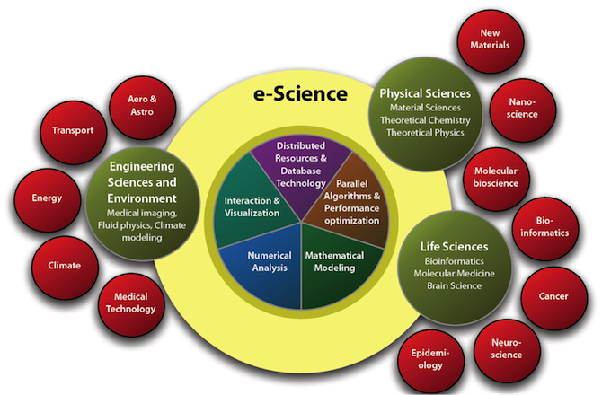
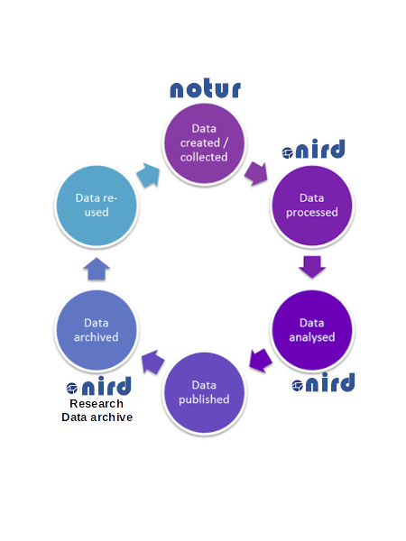

  

*   [An e-infrastructure for Science](#an-e-infrastructure-for-science)
*   [NIRD](#nird)
	*   [What is NIRD?](#what-is-nird)
	
*   [NREC](#nrec)
	*   [What is NREC?](#what-is-nrec)
	*   [Post-processing and visualization facility](#post-processing-and-visualization-facility)

## An e-infrastructure for Science

[E-science](https://en.wikipedia.org/wiki/E-Science) is the application of computer technology to the 
undertaking of modern scientific investigation, including the preparation, experimentation, data collection, 
results dissemination, and long-term storage and accessibility of all materials generated through the scientific
 process. These may include data modeling and analysis, electronic/digitized laboratory notebooks, raw and 
 fitted data sets, manuscript production and draft versions, preprints, and print and/or electronic publications.  

  

The e-infrastructure for Science in Norway follows the same structure and provides users with both computing 
resources ([Notur](#notur)) and post-processing and visualization facilities with large storage capacity 
([NIRD](#nird)).  

The picture below introduces the data life cycle from the generation of your model outputs on Notur computing facility to the preservation of your model results in the [NIRD archive](https://archive.sigma2.no/).  

  
  
## NIRD

### What is NIRD?

[NIRD](https://documentation.sigma2.no/storage/nird.html) is National e-Infrastructure for Research Data for storing scientific data.  

NIRD facility is divided in two parts:

*   Active data, which are processed or being analysed, are stored in the [Project Area](https://documentation.sigma2.no/storage/nird.html#project-area).
*   When the data are no longer expected to change and/or results have been published, the data should normally be made accessible to the public. Data can be transferred to the [NIRD Archive](https://archive.sigma2.no/) from the Project area or directly uploaded.

When running the CAM-6 model on Saga, the model outputs are generated and stored in the temporary working area (/cluster/work/users/$USER). As mentioned earlier, the working area on Saga is a temporary storage area and data must be moved to a more permanent storage area where you will be able to easily post-process and visualize your model results.  
Model outputs will have to be moved from Saga working area (/cluster/work/users/$USER) to the NIRD project area. You can use scp to copy your data from Saga to NIRD but the detailed procedure will be explained later.  

### What is a Research Data Archive?

Data archiving is the practice of moving data to a separate storage device that is no longer needed for everyday business operations but
may occasionally need to be accessed. 
Archiving research data facilitates the re-use and verification of research results. 
By depositing a dataset in a data repository, it is not only protected against corruption and loss, 
but also becomes findable and citable via a Digital Object Identifier [DOI](https://www.doi.org/).

This step is very important for publishing scientific results where all data used needs to be kept for about 10 years.

## NREC

### What is NREC?

NREC means Norwegian Research and Education Cloud and provides researchers from the University of Oslo or Bergen 
with cloud services.

The [NREC cloud](https://docs.nrec.no/) is based on OpenStack, which is a large framework of software components used to deliver an 
Infrastructure-as-a-Service consisting of compute, networking and storage resources.

### Post-processing and visualization facility

Once your model run is finished, you can start post-processing and generating plots. 
The machine you will be using for post-processing and visualizing your data has been created on NREC. The machine
will be accessed through a web interface using [jupyterhub](https://jupyter.org/hub).
 
We will be using [https://climate.uiogeo-apps.sigma2.no/](https://climate.uiogeo-apps.sigma2.no/).

#### Setup instructions for accessing Jupyter notebooks at Sigma2 server:

- You should have received an email message titled "JupyterHub links for GEO4962". If not please request it to the course organizers.
- Follow "invitation link" in the email message
- If you don't already have a Feide guest user account (otherwise skip this step), click "Feide guest users".
    - register a new account (do not use your UiO username as it may be confusing for everyone).
    - finish the registration process
    - click again on the "invitation link" in the email
- Login with "Feide guest users"
- Accept the different policies
- Agree to become a member of the **NS1004K**: the browser should display the message "Loading group details"
- Now go to [GEO4962 Jupyterhub](https://climate.uiogeo-apps.sigma2.no/)
- Click "Sign in with Dataporten"
- Login with Feide Guest User (Not your UiO username)
- Finally the web browser should display a page with "jupyterlab" on the upper left side

For later usage of the notebooks just use the [GEO4962 Jupyterhub link](https://climate.uiogeo-apps.sigma2.no/)

 
The main advantage of using this machine is that your data are directly accessible from anywhere through a web 
interface and the necessary post-processing and visualization packages we need are already available. 

